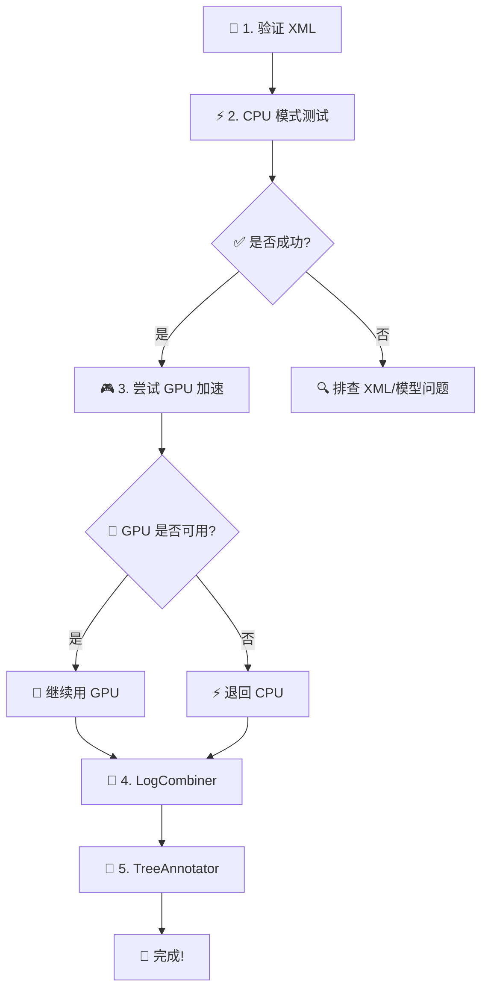

# 🧬 BEAST 三步命令行流程说明（PowerShell）

<div align="center">


  


</div>

---

## 📌 概述

由于BEAST系列软件的exe文件BUG较多，运行不稳定，且不可修改运行内存，当exe文件运行出错时建议使用命令行方法。

**这份文档给第一次用 BEAST 命令行的人准备。**

### 🔄 三个步骤

|  步骤  |     工具      | 说明                               |
| :----: | :-----------: | :--------------------------------- |
| **1️⃣** |     BEAST     | 先跑 MCMC 采样                     |
| **2️⃣** |  LogCombiner  | 再整理树文件（burn-in + resample） |
| **3️⃣** | TreeAnnotator | 最后生成注释树（MCC）              |

---

## 1️⃣ 这 3 步分别在做什么

| 程序                   | 功能说明                                          |
| :--------------------- | :------------------------------------------------ |
| 🔬 **beast.bat**       | 按 `XML` 模型做采样，产出 `.log` 和 `.trees`      |
| 🔄 **logcombiner.bat** | 对 `.trees` 去掉前期不稳定样本（burn-in）并降采样 |
| 🌳 **TreeAnnotator**   | 把后验树样本汇总成一棵代表树（常见是 MCC 树）     |

---

## 2️⃣前置条件（先准备好再跑）

### ✅ 检查清单

- [ ] **安装 BEAST**：确认目录存在，例如 `D:\Software\Tools\BEAST`
- [ ] **验证程序路径**：
  - ✓ `D:\Software\Tools\BEAST\bat\beast.bat`
  - ✓ `D:\Software\Tools\BEAST\bat\logcombiner.bat`
  - ✓ `D:\Software\Tools\BEAST\jre\bin\java`
- [ ] **准备输入文件**：
  - 📄 `InputModel.xml` - BEAST 模型配置
  - 🌲 `InputTrees.trees` - MCMC 产生的树日志
  - 🌲 `CombinedTrees.trees` - 用于注释汇总的树（可用步骤二输出）
- [ ] **（可选）GPU 加速**：安装 BEAGLE 库
- [ ] **（可选）扩展模型**：在 Package Manager 安装 SA 等插件包

### 📦 2.1 BEAST 下载链接

#### 🔗 官方资源

- 🌐 [BEAST 官网](https://www.beast2.org/)（最新版本）
- 📚 [历史版本发布页](https://github.com/CompEvol/beast2/releases)

#### ⭐ 推荐版本：2.7.7

> ⚠️ **版本兼容性**：建议使用 **2.7.7** 版本以兼容插件 SA（2.1.1）

📍 [BEAST 2.7.7 发布页](https://github.com/CompEvol/beast2/releases/tag/v2.7.7)

#### 💾 各平台安装包

| 平台               | 下载方式                                                                                                                                                | 文件大小 |
| ------------------ | ------------------------------------------------------------------------------------------------------------------------------------------------------- | -------- |
| 🪟 **Windows**     | [📥 直接本地下载](BEAST.v2.7.7.Windows.zip) <br> 或 [🌐 官网下载](https://github.com/CompEvol/beast2/releases/download/v2.7.7/BEAST.v2.7.7.Windows.zip) | ~84 MB   |
| 🍎 **macOS**       | [🌐 下载 DMG](https://github.com/CompEvol/beast2/releases/download/v2.7.7/BEAST.v2.7.7.Mac.dmg)                                                         | ~87 MB   |
| 🐧 **Linux x86**   | [🌐 下载 TGZ](https://github.com/CompEvol/beast2/releases/download/v2.7.7/BEAST.v2.7.7.Linux.x86.tgz)                                                   | ~91 MB   |
| 🐧 **Linux ARM64** | [🌐 下载 TGZ](https://github.com/CompEvol/beast2/releases/download/v2.7.7/BEAST.v2.7.7.Linux.aarch64.tgz)                                               | ~92 MB   |

> 💡 **提示**：下载后解压使用，本文档中的路径自动匹配。

---

## 3️⃣ 占位符说明

> 📝 文档中使用占位符表示需要替换的内容，请按你的实际情况修改

| 占位符                 | 说明             | 示例                                          |
| ---------------------- | ---------------- | --------------------------------------------- |
| `BEAST_HOME`           | 🏠 BEAST 根目录  | `D:\Software\Tools\BEAST`                     |
| `InputModel.xml`       | 📄 输入 XML 模型 | `24GROUP3.xml`                                |
| `InputTrees.trees`     | 🌲 MCMC 输出树   | `24GROUP3-year.trees`                         |
| `ResampledTrees.trees` | 🔄 重采样后的树  | `24GROUP3-year_resample10000_b20.trees`       |
| `CombinedTrees.trees`  | 🌳 合并后的树    | `V3yueguizuCP127-yueguizuCP131mafftCOM.trees` |
| `AnnotatedTree.tree`   | ✨ 最终注释树    | `V3yueguizuCP127-yueguizuCP131mafftMCC.tree`  |

---

## 4️⃣ BEAGLE 安装与验证

> 🚀 **性能提升**：通过 GPU 加速可大幅缩短运算时间  
> 🔰 **新手提示**：如果只是先跑通流程，可跳过本节，直接用 CPU 命令

### 🤔 4.1 你需要 BEAGLE 吗？

| 场景                               | 建议                           |
| ---------------------------------- | ------------------------------ |
| ✅ 数据量大 + 链长 + 有 NVIDIA GPU | 👍 **强烈推荐** BEAGLE + GPU   |
| 🧪 仅测试流程是否可跑              | ⚡ 用 CPU 即可（不影响正确性） |

### 🛠️ 4.2 安装步骤

#### 前置依赖（通常已具备）

| 序号 | 组件               | 说明                                                        |
| :--: | ------------------ | ----------------------------------------------------------- |
|  1   | 🎮 NVIDIA 显卡驱动 | 从 [NVIDIA 官网](https://www.nvidia.com/drivers) 下载最新版 |
|  2   | 💻 CUDA Runtime    | 版本需与 BEAGLE 兼容                                        |

> ℹ️ 一般电脑已预装，仅在出错时需手动更新

#### 安装 BEAGLE 库

**🪟 Windows 版本 (v4.0.0)**  
📥 [本地下载 MSI 安装包](BEAGLE-4.0.0-win64.msi)

**🌐 其他平台/版本**  
访问 [BEAGLE Releases](https://github.com/beagle-dev/beagle-lib/releases) 下载

#### 最后一步

🔄 **重启电脑**（建议但非必需）

### ✅ 4.3 验证 BEAGLE 是否被识别

#### 方法 1：GUI 验证

1. 打开 `BEAST.EXE`
2. 查看 **"RUN"** 按钮左边是否有 **"BEAGLE INFO"** 按钮
3. 点击后检查是否能检测到 GPU 型号等信息

#### 方法 2：命令行验证

```powershell
Set-Location "D:\Software\Tools\BEAST"
.\bat\beast.bat -beagle_info
```

✅ **成功标志**：能看到可用资源（CPU/GPU）信息

### 🔧 4.4 若BEAST识别不到BEAGLE

按以下顺序尝试：

1. ✅ 检查安装程序是否已将 BEAGLE 动态库放入系统 `PATH`
2. 🔧 手动添加 BEAGLE 动态库目录到系统 `PATH` 环境变量
3. ⚠️ 将动态库放入 BEAST 可加载位置（不推荐新手操作，容易混版本）

### 4.5 常见 BEAGLE 报错与处理

1. 报 `Cannot find BEAGLE`：
   - 说明 BEAST 没找到 BEAGLE 动态库
   - 检查 BEAGLE 是否安装成功、`PATH` 是否生效、重开终端
2. 报 `No compatible GPU`：
   - 可能是驱动/CUDA/BEAGLE 版本不匹配
   - 先改 CPU 方式跑通，再回头调 GPU
3. GPU 模式卡住或报数值错误：
   - 尝试保留 `-beagle_scaling dynamic`
   - 尝试减少 `-threads` 或改用 CPU 测试模型

---

## 5️⃣ SA（Sampled Ancestors）包安装说明

> 🧪 **扩展模型支持**：使用 SA 模型前需要安装相应插件包

### 📦 安装步骤

| 步骤 | 操作                                    |
| :--: | --------------------------------------- |
|  1   | 打开 `BEAUti`- file -`Package Manager`  |
|  2   | 🔍 搜索并安装 **SA** 相关包             |
|  3   | 🔄 重启 BEAST                           |
|  4   | ✅ 用 `-validate` 验证 XML 配置是否正确 |

**验证命令：**

```powershell
& "D:\Software\Tools\BEAST\bat\beast.bat" -validate "D:\Software\Tools\BEAST\InputModel.xml"
```

> ⚠️ **版本兼容性警告**  
> 目前 **BEAST 2.7.8** 与 **SA v2.1.1** 不兼容  
> 👉 **推荐使用 BEAST 2.7.7**

---

## 6️⃣ PowerShell 快速入门

### 🚀 基本操作

**1️⃣ 打开 PowerShell**

- 按 `Win + X` → 选择 **Windows PowerShell**
- 或搜索框输入 `powershell`

**2️⃣ 切换到 BEAST 目录**

```powershell
Set-Location "D:\Software\Tools\BEAST"
```

**3️⃣ 确认当前目录**

```powershell
Get-Location
```

### 💡 命令注意事项

| 情况                | 正确写法                    | 说明            |
| ------------------- | --------------------------- | --------------- |
| 🔤 含空格的路径     | `& "C:\My Files\beast.bat"` | 必须加双引号    |
| 📂 执行绝对路径程序 | `& "完整路径" 参数...`      | 使用 `&` 运算符 |
| 📁 执行当前目录程序 | `.\bat\beast.bat`           | 相对路径用 `.\` |

---

## 7️⃣ 步骤一：运行 BEAST（MCMC 采样）

> 🎯 **目标**：输入 `InputModel.xml`，输出链结果（`.trees` + `.log` + `.state`）

### 🚀 7.1 GPU 版（推荐）

```powershell
& "BEAST_HOME\bat\beast.bat" -beagle -beagle_GPU -beagle_order 1 -threads 12 -instances 1 -beagle_scaling dynamic "BEAST_HOME\InputModel.xml"
```

> 💻 **适用场景**：已安装 BEAGLE + NVIDIA GPU

### ⚡ 7.2 CPU 版（通用）

```powershell
& "BEAST_HOME\bat\beast.bat" -threads 12 -instances 1 -beagle_scaling dynamic "BEAST_HOME\InputModel.xml"
```

> 🔰 **适用场景**：无 GPU 或测试阶段

### 📖 7.3 参数说明

| 参数              | 说明                         | 建议值              |
| ----------------- | ---------------------------- | ------------------- |
| `-threads`        | 🧵 线程数                    | 使用 CPU 最大线程数 |
| `-instances`      | 🔢 BEAGLE 实例数             | 单链用 `1`          |
| `-beagle_scaling` | 📊 动态缩放（防止数值溢出）  | `dynamic`           |
| `-beagle`         | ✅ 启用 BEAGLE 加速          | GPU 版必填          |
| `-beagle_GPU`     | 🎮 优先使用 GPU              | GPU 版必填          |
| `-beagle_order`   | 🔢 资源顺序（多 GPU 时调整） | 默认 `1`            |

### ✅ 7.4 成功标志

- ✓ 终端**持续输出**采样进度（无致命报错）
- ✓ 目录中出现/更新输出文件：
  - 📄 `.log` - 参数日志
  - 🌲 `.trees` - 树日志
  - 💾 `.state` - 状态文件

### ⚠️ 7.5 常见错误排查

| 错误类型         | 解决方案                                       |
| ---------------- | ---------------------------------------------- |
| 🔴 XML 报错      | 先执行 `-validate` 检查配置文件                |
| 🎮 GPU 报错      | 改用 CPU 命令确认模型本身正常                  |
| 💥 闪退/内存不足 | 减少线程数，或在启动脚本中增加 Java 堆内存配置 |

---

## 8️⃣ 步骤二：LogCombiner（整理树文件）

> 🔄 **目标**：去除 burn-in + 降采样 = 干净的后验树样本

### ⚙️ 目标配置

| 参数          | 值    | 说明                     |
| ------------- | ----- | ------------------------ |
| 📂 文件类型   | Tree  | 处理 `.trees` 文件       |
| 🔥 Burn-in    | 20%   | 去掉前 20% 不稳定样本    |
| 📉 重采样频率 | 10000 | 每 10000 个状态保留 1 个 |

### 💻 执行命令

```powershell
.\bat\logcombiner.bat -log .\InputTrees.trees -o .\ResampledTrees.trees -b 20 -resample 10000
```

### 📖 参数说明

| 参数        | 说明                                  |
| ----------- | ------------------------------------- |
| `-log`      | 📥 输入文件（`.log` 或 `.trees`）     |
| `-o`        | 📤 输出文件名                         |
| `-b 20`     | 🔥 去掉前 20% 作为 burn-in            |
| `-resample` | 🔢 降采样频率（每 N 个状态保留 1 个） |

> 💡 **提示**：当 `-log` 输入是 `.trees` 文件时，自动按树模式处理（等价于 GUI 勾选 `tree file`）

---

## 9️⃣ 步骤三：TreeAnnotator 生成注释树

> 🌳 **目标**：把后验树样本汇总成一棵代表树（通常是 MCC 树），便于可视化和报告

### 💻 执行命令

```powershell
& "BEAST_HOME\jre\bin\java" -Xms4g -Xmx16g -Xss4m -cp "BEAST_HOME\lib\launcher.jar" beast.pkgmgmt.launcher.TreeAnnotatorLauncher -burnin 0 -height median "BEAST_HOME\CombinedTrees.trees" "BEAST_HOME\AnnotatedTree.tree"
```

### 📖 参数说明

#### Java 内存配置

| 参数   | 说明          | 建议值                            |
| ------ | ------------- | --------------------------------- |
| `-Xms` | 💾 初始内存   | `4g`                              |
| `-Xmx` | 📊 最大内存   | 32G 电脑用 `16g`，16G 电脑用 `8g` |
| `-Xss` | 🧵 线程栈大小 | `4m`                              |

> ⚠️ **内存不足警告**：若 `-Xmx` 设置太小，生成树时会因内存溢出失败

#### TreeAnnotator 参数

| 参数      | 说明                              | 值       |
| --------- | --------------------------------- | -------- |
| `-burnin` | 🔥 Burn-in 百分比（步骤二已处理） | `0`      |
| `-height` | 📏 节点高度统计方法               | `median` |
| 输入文件  | 🌲 处理好的后验树样本             | —        |
| 输出文件  | ✨ 最终注释树（MCC）              | —        |

---

## 🔟 完整命令模板（一键复制）

> 📋 **使用说明**：复制以下代码块，替换 `BEAST_HOME` 等占位符后直接运行

```powershell
# ============================================
# BEAST 三步流程完整命令模板
# ============================================

# 📂 0) 进入 BEAST 目录
Set-Location "BEAST_HOME"

# ✅ 1) 可选：验证 XML 是否能解析
& "BEAST_HOME\bat\beast.bat" -validate "BEAST_HOME\InputModel.xml"

# 🔬 2) 运行 MCMC 采样

# 方式A：CPU 版（通用）
& "BEAST_HOME\bat\beast.bat" -threads 12 -instances 1 -beagle_scaling dynamic "BEAST_HOME\InputModel.xml"

# 方式B：GPU 加速版（需 BEAGLE）
& "BEAST_HOME\bat\beast.bat" -beagle -beagle_GPU -beagle_order 1 -threads 12 -instances 1 -beagle_scaling dynamic "BEAST_HOME\InputModel.xml"

# 🔄 3) 处理树文件（burnin 20% + 降采样 10000）
.\bat\logcombiner.bat -log .\InputTrees.trees -o .\ResampledTrees.trees -b 20 -resample 10000

# 🌳 4) 生成注释树（MCC）
& "BEAST_HOME\jre\bin\java" -Xms4g -Xmx16g -Xss4m -cp "BEAST_HOME\lib\launcher.jar" beast.pkgmgmt.launcher.TreeAnnotatorLauncher -burnin 0 -height median "BEAST_HOME\CombinedTrees.trees" "BEAST_HOME\AnnotatedTree.tree"

# ✅ 完成！
```

---

## 1️⃣1️⃣ 新手推荐工作流程

> 🎓 **首次使用建议**：按以下顺序逐步验证，避免跳步导致难以排查问题



### 📋 执行清单

| 步骤 | 操作                             | 目的                   |
| :--: | -------------------------------- | ---------------------- |
|  1   | ✅ 先跑 `-validate`              | 确保 XML 配置正确      |
|  2   | ⚡ 先用 **CPU 模式**跑通一次     | 验证模型和数据本身正常 |
|  3   | 🎮 再尝试启用 **GPU（BEAGLE）**  | 若成功可大幅加速       |
|  4   | 🔄 MCMC 完成后做 **LogCombiner** | 整理树文件             |
|  5   | 🌳 最后运行 **TreeAnnotator**    | 生成最终可视化注释树   |

> 💡 **提示**：若 GPU 配置困难或不支持，用 CPU 完全可行，只是运行时间更长

---

<div align="center">

### 🎉 恭喜完成 BEAST 命令行流程配置！

**有问题？** 检查 [BEAST 官方论坛](https://groups.google.com/g/beast-users) 或提交 Issue

⭐ 如果这份文档对你有帮助，欢迎 Star 本仓库！

</div>
